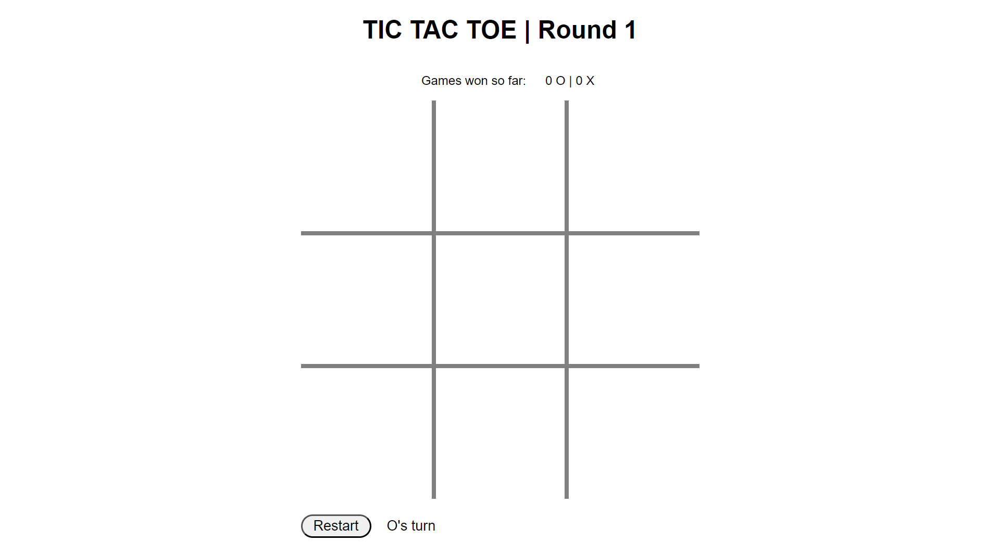

# Welcome to my first project!

It's my take on a classic game of tic tac toe.

You can have a go at it on this link:
https://pages.git.generalassemb.ly/utamakevin/tic_tac_toe/

Hope you enjoy!

## Now Let's Get Technical

This game was made with JavaScript.

The logic behind the game is quite straight-forward:

### Generating Player Moves
- When user click on a tile, it is marked with either O or X. The Xs and Os are text values of the box clicked on that particular turn. Whether the text would be X or O depends on the previous click, alternating between the Xs and Os for every click.

### Winning Conditions
- The winning condition checks if there are three markers of a type that are in a line either horizontally, vertically or diagonally. The winning conditions are checked after every move.
- When there is no winner, **the board reset** and the game continues until there is a winner. There will be no draw.
- When there is a winner, the background colour change depending on the winner.

### Resetting The Board
- When there is a winner or a draw, the board will reset. In draw situation, the board will automatically reset to continue the game. In winning situation, the board will retain the final placements of markers for players to observe and a restart button will appear.
- The losing player gets to play first in the next round.

### Miscellaneous Features
- There is a counter at the top that keeps track of the rounds played.
- There is a prompt at the bottom that keep track of who's turn it is.
- Click sound is added on player moves.
